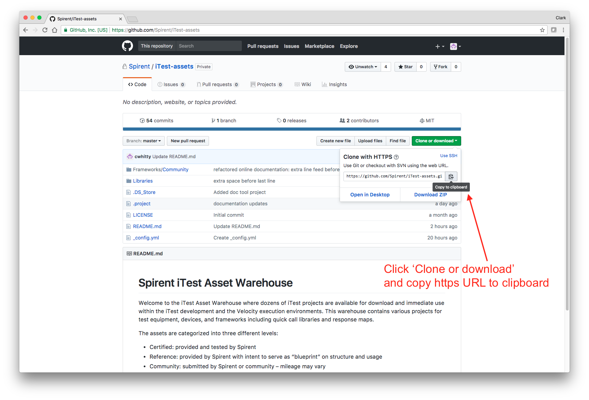
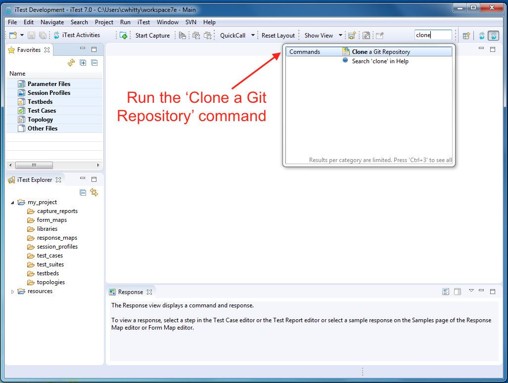
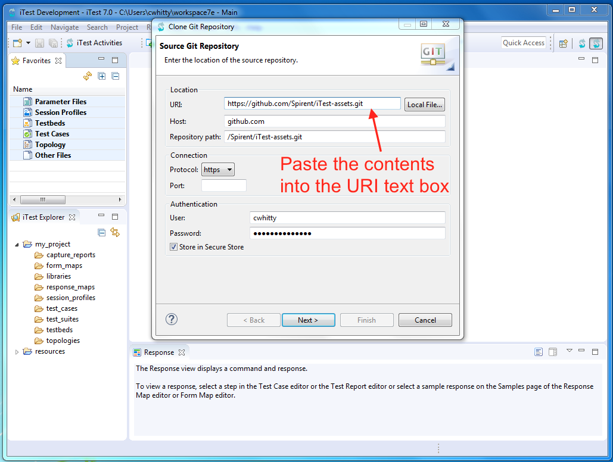
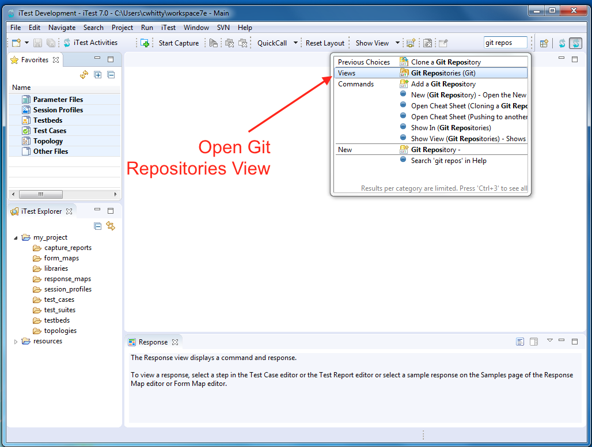
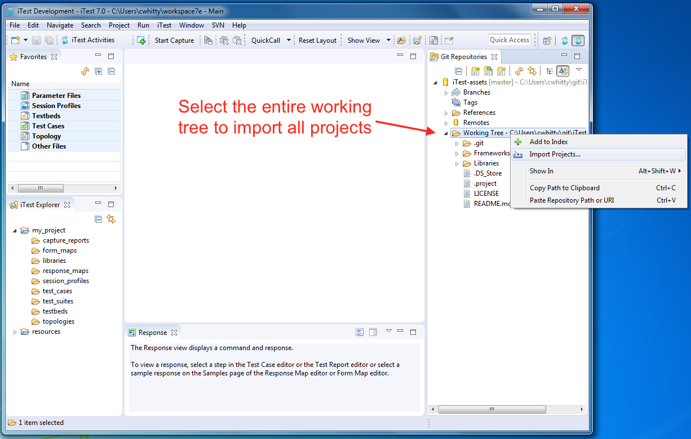
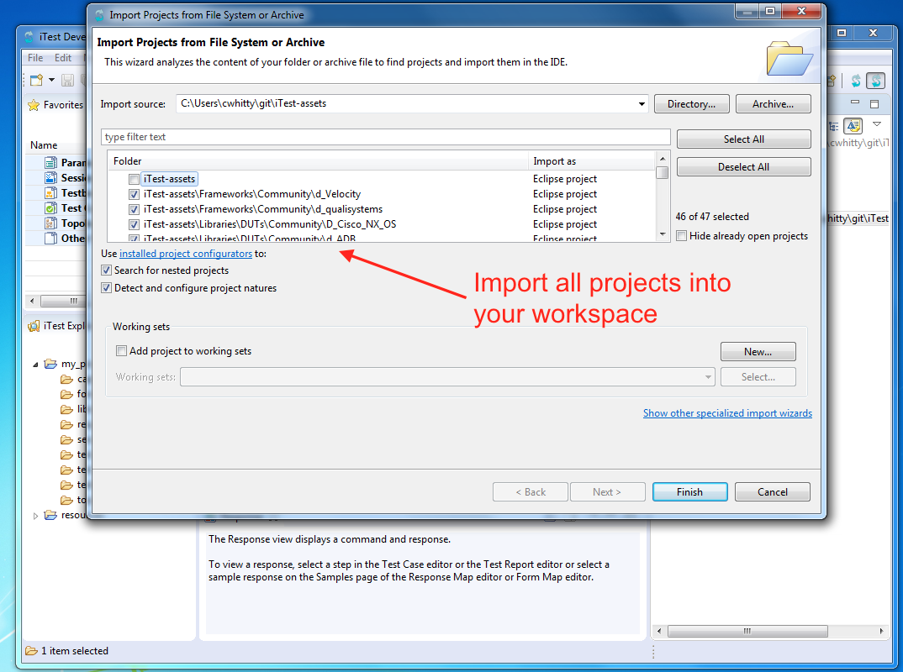
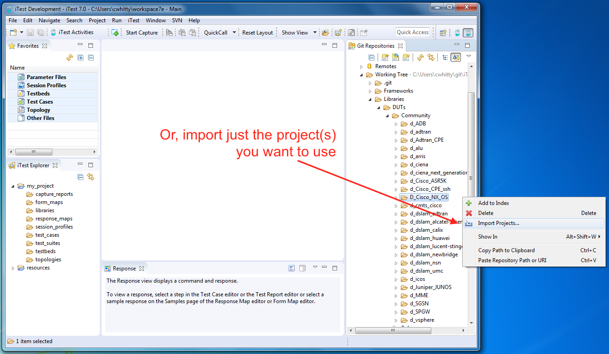

# &emsp;&emsp;&emsp;&emsp;&emsp;&emsp;&emsp;Spirent Developer Community
 <table>
  <tr>
     <td></td> 
   <td style="font-size:x-large"> &emsp;&emsp;&emsp;&emsp;&emsp;&emsp;&emsp;&emsp;&emsp;&emsp;&emsp;&emsp;&emsp;&emsp;&emsp;&emsp;&emsp;&emsp;&emsp;&emsp;&emsp;&emsp;&emsp;&emsp;&emsp;&emsp;&emsp;&emsp;&emsp;&emsp;&emsp;&emsp;&emsp;&emsp;&emsp;&emsp;&emsp;&emsp;&emsp;&emsp;</td>
    <td>
  </tr>
</table>

Welcome to the Spirent Developer Community! You'll find a wide variety of useful automation assets for your iTest projects and Velocity deployments.  This repository is specific to iTest.  The Velocity repository is located [here](https://github.com/Spirent/Velocity-assets).  All Spirent Developer Community assets are available for your immediate download and use. 

 <table style="width:100%; border: 5px solid gray;">
  <tr>
     <td style="color:white">&emsp;&emsp;&emsp;&emsp;&emsp;&emsp;&emsp;&emsp;&emsp;&emsp;</td> 
    <td style="border: 0px solid black;">This portion of the Spirent Developer Community contains a selection of iTest projects. They are useful for gaining the greatest value from your test equipment, devices, and frameworks. The assets are rich in reusable QuickCall libraries and Response Maps.  Both are key capabilities that will help you create your own automation most efficiently.  They will help you whether or not you are using Python or an Automation framework (e.g., Robot).</td>
    <td>&emsp;&emsp;&emsp;&emsp;&emsp;&emsp;&emsp;&emsp;&emsp;&emsp;</td>
  </tr>
</table>

All assets in are categorized into three levels of maturity/testing:
- Certified:  provided and tested by Spirent
- Reference:  provided by Spirent with intent to serve as “blueprint” for your project's structure and usage
- Community:  submitted by community or Spirent personnel with no review or testing by Spirent       

You are encouraged to submit your projects back to the Spirent Developer Community for others to benefit from.

Each project within this repository conforms to a standard naming convention. Project names are pre-pended with two letters. The first letter indicates what type of content exists in the project, and the second letter indicates the language in which the project was written. For example, a project called di_foobar contains a device project written in iTest. The tables below list the prefix values:

|First Letter|Project Content|Description|
| -------- |-------------| -------------| 
|d|Libraries|Response maps and QuickCalls|
|a|Automation|Test cases|
|r|Drivers|Velocity drivers|
|t|Tasks|Velocity startup, teardown, and triggered automation tasks|
|k|Dashboards|Velocity dashboards|
|u|Utilities|Tools and utilities|

|Second Letter|Language|Description|
| -------- |-------------| -------------|
|i|iTest|All content in project is iTest content|
|p|Python|All content in project is Python content|
|b|Bash|All content in project is Bash content|
|s|Scripts|Project content is written in another language or a combination of iTest, Python, Bash|

## Quick Start
 

